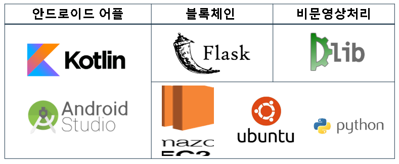
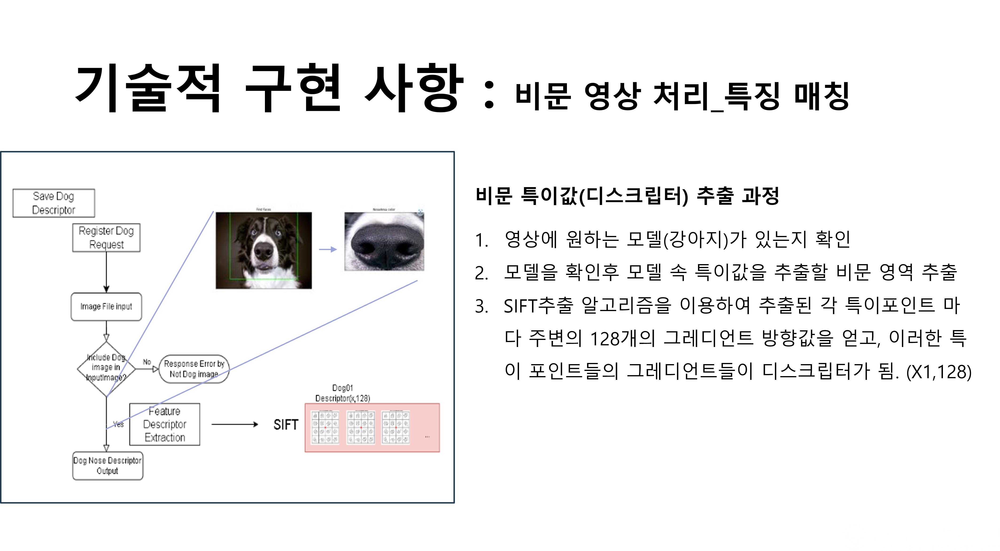
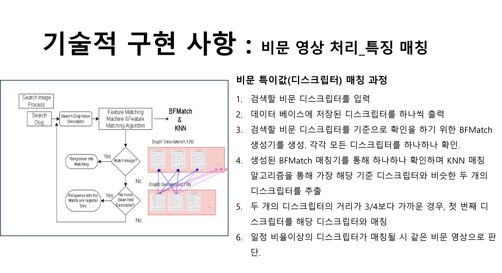
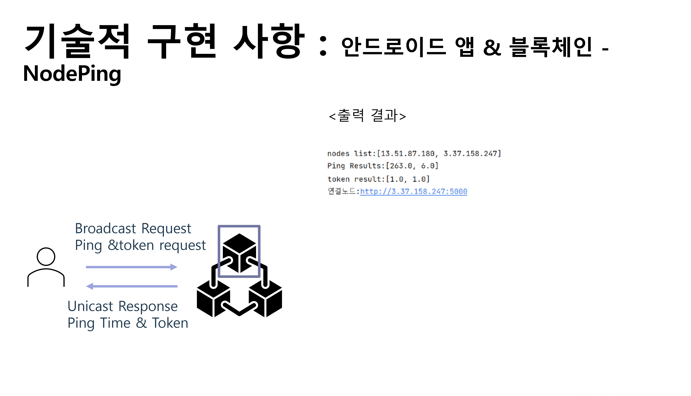
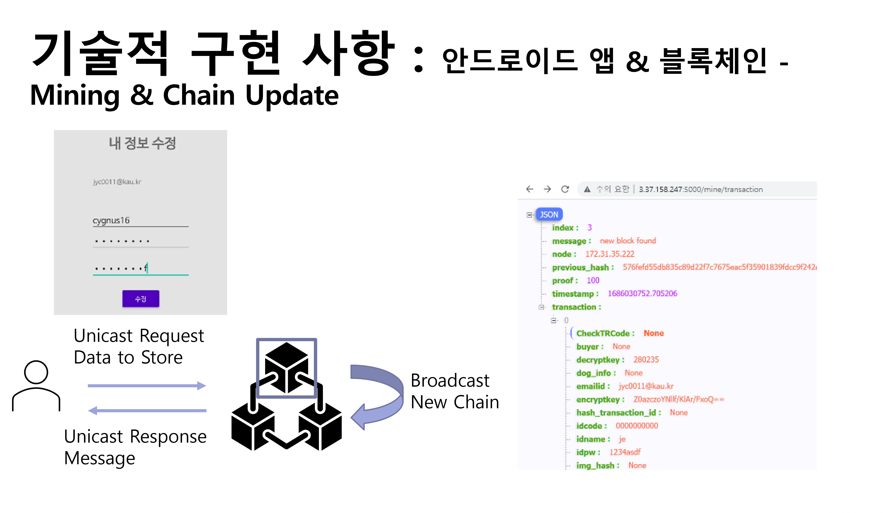
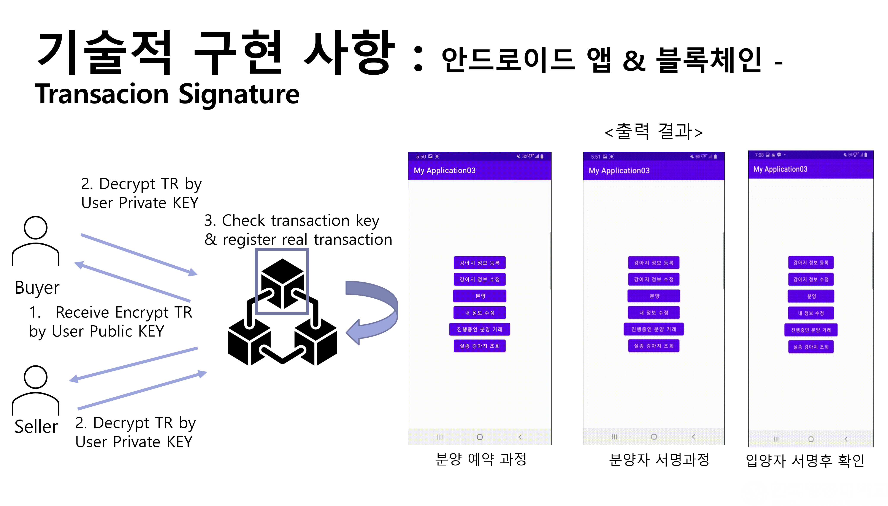
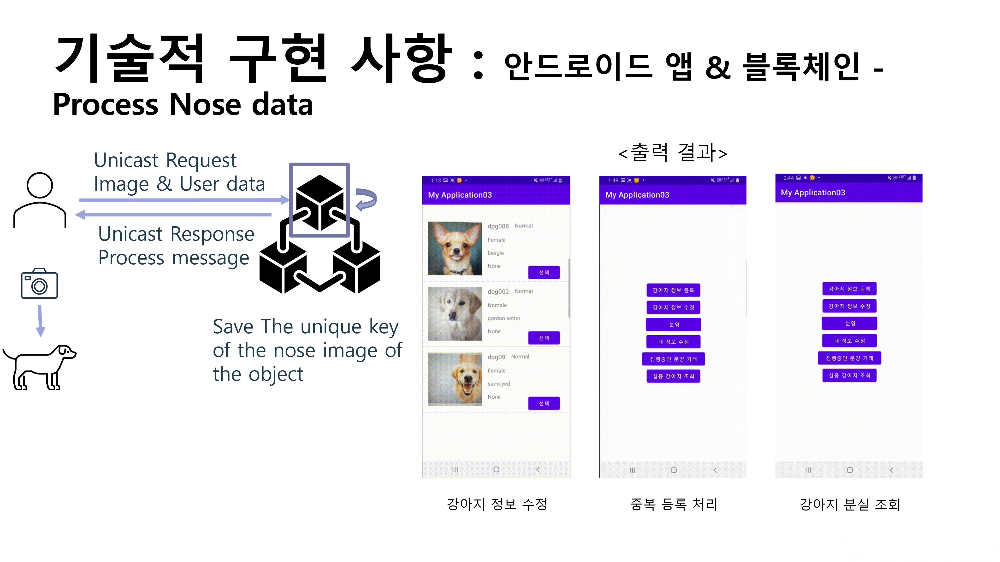
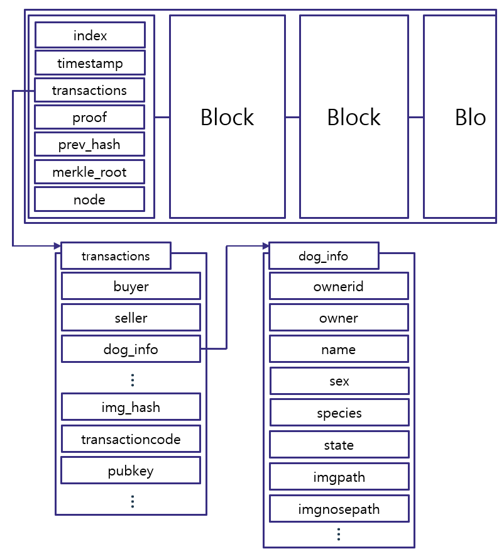
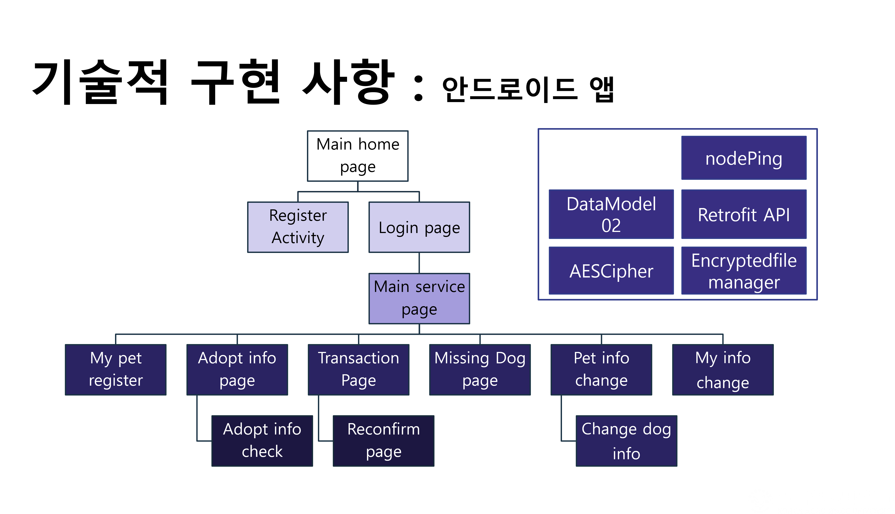
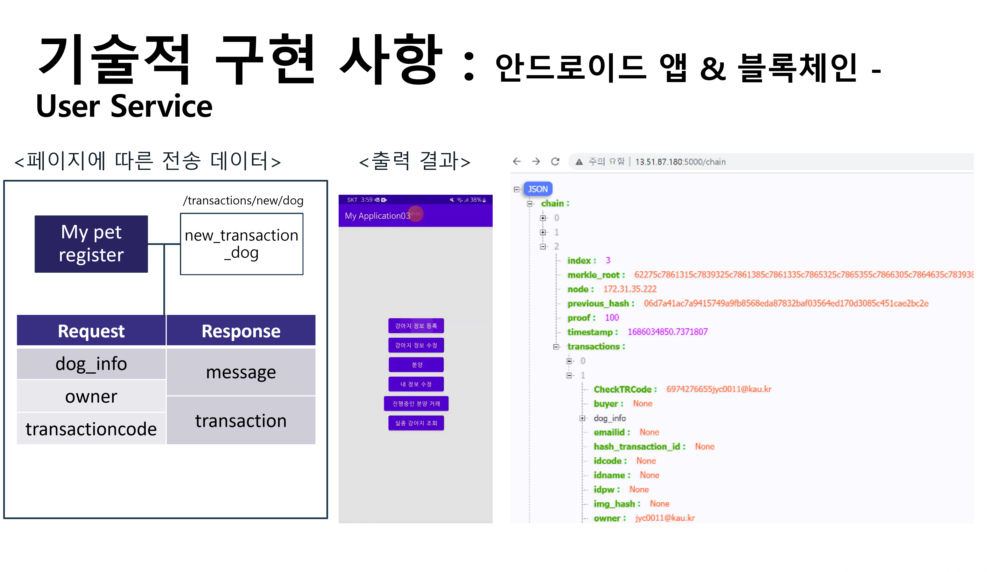

# Dog Nose-Print Inquiry Service From Distributed DB Using Blockchain


<!--프로젝트 대문 이미지-->


<!--프로젝트 버튼-->
 [![Readme in English][readme-eng-shield]][readme-eng-url] [![View Demo][view-demo-shield]][view-demo-url] [![Report bug][report-bug-shield]][report-bug-url] [![Request feature][request-feature-shield]][request-feature-url]

# [1] About the Project
## 🦮블록체인을 이용한 분산형 DB로부터의 강아지 비문 조회 서비스

### 1. 연구 배경 및 필요성🐕‍🦺

- 반려동물 시장 성장: 한국농촌경제연구원에 따르면, 2015년 1조 9천억 원 규모였던 국내 반려동물 시장이 2023년에는 4조 5,786억 원에 이르렀고, 2027년에는 6조 원 규모까지 성장할 것으로 전망됩니다.


<연간 유기 및 유실 동물 개체수 증가 추이>


<서울시 유기견 피해 현황>

- 사회적 문제: 반려동물 인구 증가에 따라 불법 품종 개량, 유기 동물 증가 등의 사회적 문제가 대두되고 있습니다.


- 2022년 10월 15일 카카오 데이터센터 화재로, 서비스 이용에 불편을 겪은 바 있음. 이에 따라 분산형 DB의 필요를 느낌.

### 2. 기존 해결방안의 한계🐕‍🦺
- RFID 사용의 문제점: 무선식별 장치(RFID)를 삽입 또는 부착하는 방법은 큰 비용이 들며 낮은 등록률을 보이고 있습니다.
- 비문(코 무늬) 활용: 사람의 지문처럼 강아지의 비문은 고유한 특징을 가지고 있어 개체 구별에 효과적입니다.

### 3. 제안하는 시스템🐕‍🦺
- 블록체인 기반 분산형 DB: 블록체인의 위변조 방지 기능과 분산형 데이터베이스를 결합하여, 안전하고 투명한 데이터 저장 및 조회 시스템을 구축합니다.
- 비문 인식 및 등록: 강아지의 비문을 인식하여 개체의 정보와 소유주를 등록하고, 이를 통해 분양 및 추적 시스템을 구현합니다.

### 4. 시스템의 장점🐕‍🦺
- 보안성과 투명성: 블록체인의 특성을 이용하여 데이터의 투명성과 보안성을 높입니다.
- 분산 처리: 분산형 데이터베이스 구조를 통해 네트워크 처리 속도를 향상시킵니다.
- 효율적인 유기견 문제 해결: 비문을 이용한 개체 식별 시스템으로 유기견 문제를 효과적으로 해결할 수 있습니다.

### 5. 연구 의의 및 실제 구현🐕‍🦺
- 실제 애플리케이션 구현: 이론적인 제시를 넘어 실제로 블록체인을 이용한 분산형 DB와 강아지 비문 조회 서비스를 실행할 수 있는 애플리케이션을 구현하였습니다.
- 사회적 기여: 반려동물 문제 해결에 기여하고, 보다 나은 반려동물 문화를 구축하는 데 의의를 둡니다.

## Features

### 비문(코 무늬) 활용
- 강아지의 비문은 사람의 지문처럼 고유한 특징을 가지며, 이를 이용해 개체를 구별할 수 있습니다.

### 블록체인 기반 분산형 데이터베이스
- 블록체인의 위변조 방지 기능과 분산형 데이터베이스를 결합하여 데이터의 보안성과 투명성을 확보합니다. 이를 통해 강아지의 비문 데이터를 안전하게 저장하고 조회할 수 있습니다.

### 비문 인식 및 등록 시스템
- 강아지의 비문을 인식하여 개체 정보를 등록하고, 이를 기반으로 분양 및 추적 시스템을 구현합니다.

### 보안성과 투명성
- 블록체인을 이용하여 데이터의 보안성과 투명성을 높이고, 이를 통해 반려동물의 개체 식별과 추적을 보다 안전하게 관리할 수 있습니다.

### 분산 처리: 
- 분산형 데이터베이스 구조를 통해 네트워크 처리 속도를 개선하여 효율적인 데이터 관리가 가능합니다.

## 2. Technologies Stack



- [FLASK](https://flask.palletsprojects.com/en/3.0.x/)
- [AWS EC2](https://aws.amazon.com/ko/pm/ec2/?gclid=Cj0KCQjw2ou2BhCCARIsANAwM2Fvl1JEgLF-nt9pi6LoAAjTDbIZtSxlKan5_r2ELY6JUkk748ac8A0aAvxpEALw_wcB&trk=4c74fd91-5632-4f18-ac76-a6c66c92e185&sc_channel=ps&ef_id=Cj0KCQjw2ou2BhCCARIsANAwM2Fvl1JEgLF-nt9pi6LoAAjTDbIZtSxlKan5_r2ELY6JUkk748ac8A0aAvxpEALw_wcB:G:s&s_kwcid=AL!4422!3!477203497843!e!!g!!aws%20ec2!11549843702!111422708806) 
- [Android Studio](https://developer.android.com/studio?gad_source=1&gclid=Cj0KCQjw2ou2BhCCARIsANAwM2ElJwpX8AmXHdmDqeFXJeiNQMz6gyhSunPf7V0LzFr2tV11ZdIBClkaArGyEALw_wcB&gclsrc=aw.ds&hl=ko) 
- [Dlib](https://dlib.net/)
# 3. Project Process

## 🦮비문 영상 처리부





## 🚪블록 체인 구현부 










(블록체인 블록 구조)


## 📱어플리케이션 구현




```java
// 몇 개의 API 사용 예제를 코드와 함께 보여주세요.
```


# Contact
- 📧 wodud6423@kau.kr

